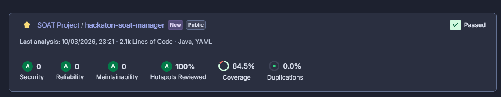

# Video Manager API

## Pipeline de Deploy e Testes

O projeto possui uma pipeline automatizada responsável por build, execução de testes e análise de qualidade de código a cada alteração no repositório.

Durante o processo de CI:

- Os testes automatizados são executados
- A cobertura de testes é gerada com JaCoCo
- A qualidade do código é analisada pelo SonarCloud

Somente após a validação dessas etapas o build da aplicação é considerado válido.

Após o merge na branch principal, uma pipeline adicional realiza:

- Build da imagem Docker
- Push da imagem
- Deploy no cluster Kubernetes (AWS EKS)

---

## Arquitetura da API

Esta API atua como um manager do pipeline de processamento de vídeos.

Ela é responsável por:

- Receber o upload de vídeos
- Armazenar arquivos no Amazon S3
- Registrar processos no DynamoDB
- Enviar mensagens para o worker processor via fila
- Receber o resultado do processamento
- Atualizar o status do processo
- Enviar notificações para o serviço de notification
- Gerar URLs pré-assinadas para download

A aplicação roda em containers orquestrados via Kubernetes (EKS).

---

## Endpoints

Todos os endpoints são acessados através do Application Load Balancer:

```
<ALB_URL>/manager
```

---

### Upload de Vídeo

**POST** `<ALB_URL>/manager/videos`

Realiza o upload de um vídeo para processamento.

**Content-Type:** `multipart/form-data`

| Parâmetro   | Tipo   | Onde        | Descrição            |
|-------------|--------|-------------|----------------------|
| `file`      | File   | form-data   | Arquivo de vídeo     |
| `userId`    | String | query param | ID do usuário        |
| `videoName` | String | query param | Nome do vídeo        |

**Resposta `200`:**

```json
{
  "videoId": "5b9d0224-a558-45bd-a864-4dbc9e0d449b",
  "status": "PENDING"
}
```

---

### Listar Vídeos do Usuário

**GET** `<ALB_URL>/manager/videos?userId={userId}`

Lista todos os vídeos associados a um usuário.

| Parâmetro | Tipo   | Onde        | Descrição     |
|-----------|--------|-------------|---------------|
| `userId`  | String | query param | ID do usuário |

**Resposta `200`:**

```json
{
  "videos": [
    {
      "processId": "d3acbde2-b813-4519-bf4a-056efabcf191",
      "videoName": "naosei",
      "status": "PROCESSED",
      "createdAt": "2026-02-17T22:50:53.997711300Z",
      "processedAt": "2026-02-17T22:53:20.368773800Z"
    }
  ]
}
```

---

### Buscar Vídeo por ProcessId

**GET** `<ALB_URL>/manager/videos/{processId}`

Retorna os detalhes de um processo específico.

| Parâmetro   | Tipo   | Onde | Descrição       |
|-------------|--------|------|-----------------|
| `processId` | String | path | ID do processo  |

**Resposta `200`:**

```json
{
  "processId": "578d8bae-1251-46f9-b12c-66598717068d",
  "userId": "12345",
  "status": "FAILURE",
  "createdAt": "2026-02-17T03:22:19.529041100Z",
  "processedAt": "2026-02-17T03:24:59.371117300Z"
}
```

---

### Download de Vídeo Processado

**GET** `<ALB_URL>/manager/videos/{processId}/download`

Retorna uma URL pré-assinada do S3 para download do arquivo processado. A URL possui validade temporária.

| Parâmetro   | Tipo   | Onde | Descrição      |
|-------------|--------|------|----------------|
| `processId` | String | path | ID do processo |

**Resposta `200`:**

```json
{
  "downloadUrl": "https://...",
  "expiresAt": "2026-02-17T23:06:23.446461700Z",
  "fileName": "2026-02-16 22-41-20.mp4"
}
```

---

## Status Possíveis

O processamento de vídeos pode assumir os seguintes estados:

| Status      | Descrição                        |
|-------------|----------------------------------|
| `PENDING`   | Aguardando processamento         |
| `PROCESSED` | Processamento concluído          |
| `FAILURE`   | Falha durante o processamento    |

---

## Qualidade e Cobertura de Testes

O projeto utiliza **SonarCloud** para análise estática de código e acompanhamento da cobertura de testes. A cobertura é gerada automaticamente através do **JaCoCo** durante a pipeline de CI.
Atualmente a aplicação conta com 84,5% de cobertura de testes.



Atualmente a aplicação conta com **84,5% de cobertura de testes**.